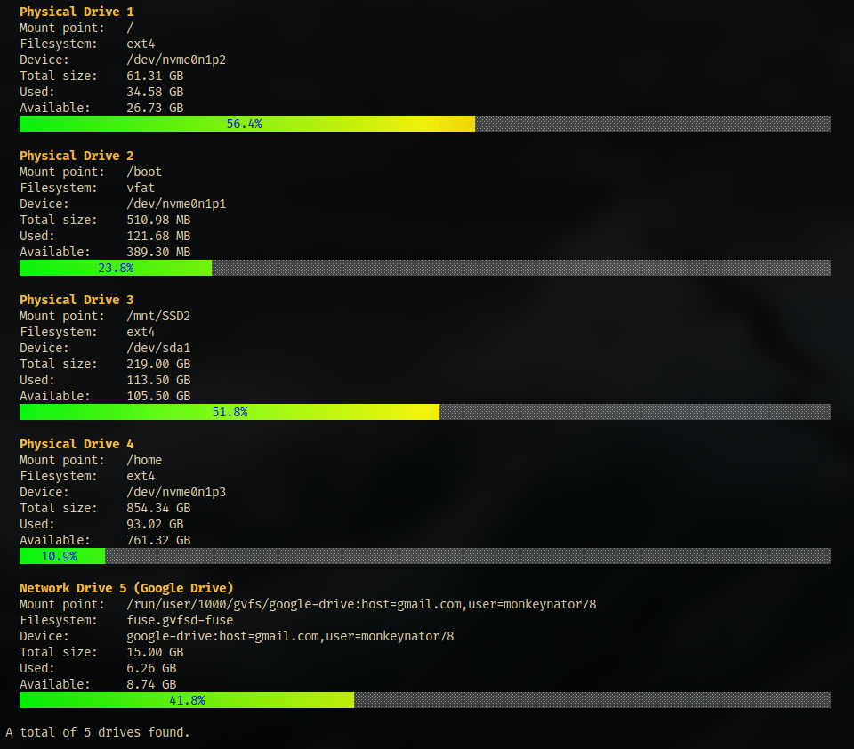

# drinfo - drive info
Version: 1.2.0


A lightweight command-line tool to monitor disk usage on Linux systems with beautiful colored progress bars.

## Features

- **Physical Drive, Network (cloud) Drive Detection**: List all physical and network drives (also cloud drives)
- **Colorful Progress Bars**: Visual representation of disk usage with gradient colors (green → yellow → red)
- **Human-Readable Sizes**: Displays sizes in B, KB, MB, GB, TB format
- **Terminal Responsive**: Adapts to terminal width for optimal display
- **Detailed Information**: Shows mount point, filesystem type, device path, UUID, label, mount options, used, available and inodes + SMART status (only as root)
- **JSON Output**: Export drive information in JSON format for easy parsing
- **Sorting**: Sort drives by size, usage, mount point, or name
- **No Color Mode**: Disable ANSI colors for scripts or logs

## Usage

```bash
drinfo [OPTIONS]
```

### Options

- `-h, --help`: Show help message
- `-v, --version`: Show program version
- `-j, --json`: Output in JSON format
- `-n, --no-color`: Disable color output
- `-s, --sort TYPE`: Sort drives by TYPE (`size`, `usage`, `mount`, `name`)

## Build executable: drinfo

```bash
make
```

## install with man page

```bash
sudo make install
```

## Uninstall

```bash
sudo make uninstall
```

## Archlinux:

There is "drinfo-git" in the AUR !

## Screenshot


