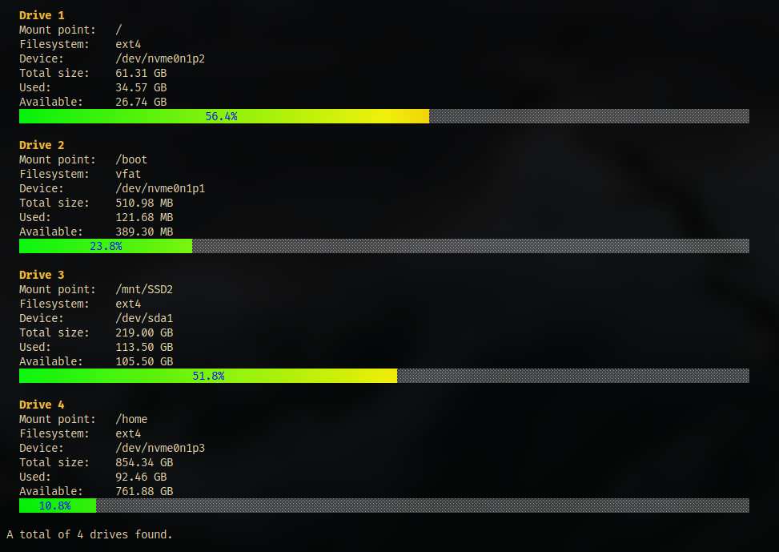

# drinfo - drive info


A lightweight command-line tool to monitor disk usage on Linux systems with beautiful colored progress bars.

## Features

- **Physical Drive Detection**: Automatically detects and displays only physical storage devices
- **Colorful Progress Bars**: Visual representation of disk usage with gradient colors (green → yellow → red)
- **Human-Readable Sizes**: Displays sizes in B, KB, MB, GB, TB format
- **Terminal Responsive**: Adapts to terminal width for optimal display
- **Detailed Information**: Shows mount point, filesystem type, device path, and usage statistics

## Build

```bash
make
```

## install

```bash
sudo make install
```

## Screenshot


