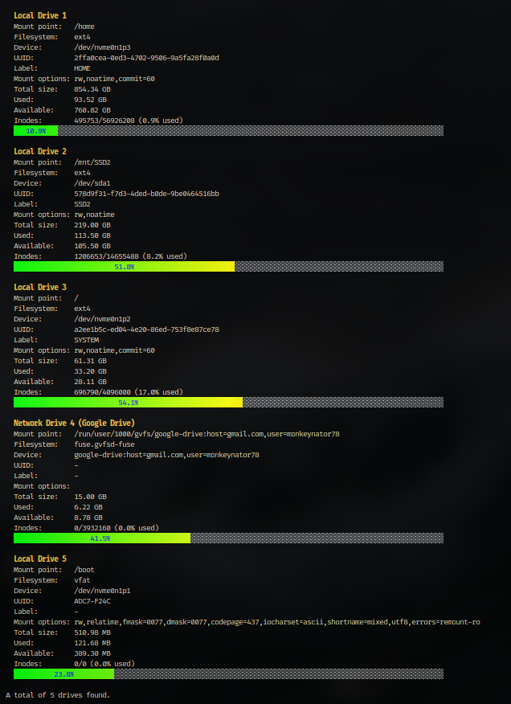

# drinfo - drive info


A lightweight command-line tool to monitor disk usage on Linux systems with beautiful colored progress bars.

## Features

- **Physical Drive, Network (cloud) Drive Detection**: List all physical and network drives (also cloud drives)
- **Colorful Progress Bars**: Visual representation of disk usage with gradient colors (green → yellow → red)
- **Human-Readable Sizes**: Displays sizes in B, KB, MB, GB, TB format
- **Terminal Responsive**: Adapts to terminal width for optimal display
- **Detailed Information**: Shows mount point, filesystem type, device path, UUID, label, mount options, used, available and inodes + SMART status (only as root)

## Build executable: drinfo

```bash
make
```

## install with man page

```bash
sudo make install
```

## Uninstall

```bash
sudo make uninstall
```

## Screenshot


